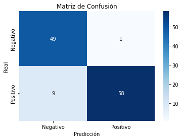
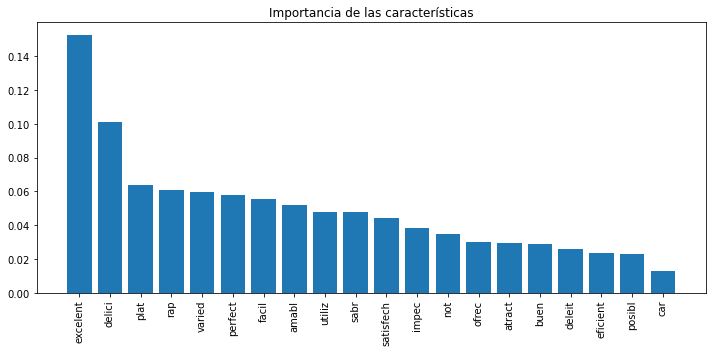
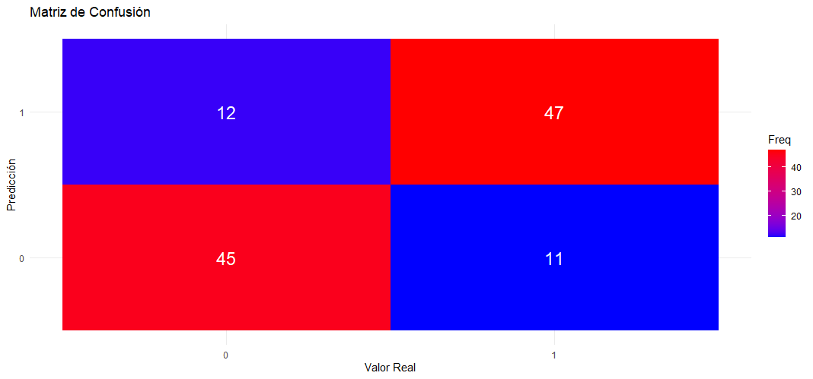
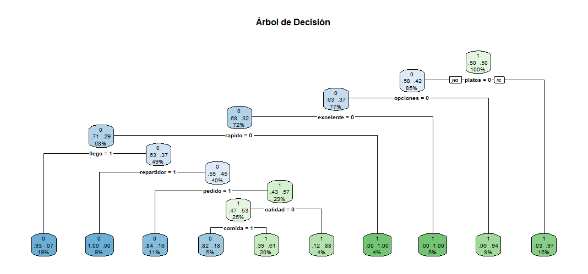
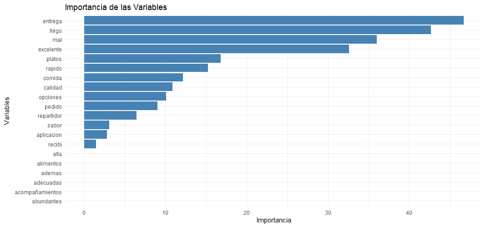

# Análisis Lenguaje natural Python y R Machine learning 

## Tabla de Contenidos

- [Descripción del Proyecto](#descripción-del-proyecto)
- [Estructura del Proyecto](#estructura-del-proyecto)
- [Dataset](#dataset)
- [Procesamiento y Análisis](#procesamiento-y-análisis)
  - [Procesamiento en Python](#procesamiento-en-python)
  - [Procesamiento en R](#procesamiento-en-r)
- [Comparación entre Python y R](#comparación-entre-python-y-r)
- [Visualizaciones](#visualizaciones)
- [Referencias](#Referencias)

## Descripción del Proyecto

Este proyecto tiene como objetivo analizar reseñas de servicios de comida a domicilio para clasificar las opiniones de los usuarios en positivas o negativas. Se ha creado un conjunto de datos único utilizando ChatGPT, y se han implementado dos scripts de procesamiento y análisis: uno en **Python** y otro en **R**. Ambos scripts realizan preprocesamiento de texto y creación de modelos de clasificación (Árboles de Decisión).

---
## Requisitos

- - **Python 3.8+, spyther, Rstudio**


## Instalación

1. **Clonar el Repositorio**
   ```bash
   git clone https://github.com/moises60/Analisis-Lenguaje-natural-Python-y-R-Machine-learning.git
   ```
---

## Dataset

El dataset **comida_a_domicilio_reviews.tsv** contiene reseñas de servicios de comida a domicilio. Cada reseña está etiquetada con una clasificación binaria:

- `Liked`: 
  - `1` indica una reseña positiva.
  - `0` indica una reseña negativa.

**Origen del Dataset:** El conjunto de datos fue creado utilizando ChatGPT, generando 600 reseñas únicas y variadas con diferentes niveles de expresividad y longitud. 
Aun así, se repiten ciertos patrones, por eso la tasa de acierto luego es bastante buena.

## Procesamiento y Análisis

### Procesamiento en Python

El script **procesar_comida_a_domicilio.py** realiza las siguientes tareas principales:

1. **Preprocesamiento de Texto:** 
   - Limpieza del texto: eliminación de caracteres especiales, conversión a minúsculas, eliminación de stopwords en español y aplicación de stemming.
   - Creación de la matriz Bag of Words.
2. **División del Dataset:** Se divide el dataset en conjuntos de entrenamiento (65%) y prueba (35%).
3. **Entrenamiento del Modelo:** Se utiliza un clasificador de **Árbol de Decisión** (`DecisionTreeClassifier`) para entrenar el modelo.
4. **Evaluación del Modelo:** Se generan predicciones, se calcula la matriz de confusión y se obtienen métricas de rendimiento como precisión, recall y F1-score.

**Resultados Obtenidos en Python:**
```
[[49  1]
 [ 9 58]]
Precisión del modelo: 91.45%
Reporte de Clasificación:
              precision    recall  f1-score   support

           0       0.84      0.98      0.91        50
           1       0.98      0.87      0.92        67

    accuracy                           0.91       117
   macro avg       0.91      0.92      0.91       117
weighted avg       0.92      0.91      0.91       117
```

### Procesamiento en R

El script **procesar_comida_a_domicilio.R** realiza las mismas tareas que el script anteriro. 

**Resultados Obtenidos en R:**

Los resultados en R son un poco diferentes:
Confusion Matrix and Statistics

          Reference
Prediction  0  1
         0 45 11
         1 12 47
                                          
               Accuracy : 0.8             
                 95% CI : (0.7152, 0.8688)
    No Information Rate : 0.5043          
    P-Value [Acc > NIR] : 5.279e-11       
                                          
                  Kappa : 0.5999          
                                          
 Mcnemar's Test P-Value : 1               
                                          
            Sensitivity : 0.7895          
            Specificity : 0.8103          
         Pos Pred Value : 0.8036          
         Neg Pred Value : 0.7966          
             Prevalence : 0.4957          
         Detection Rate : 0.3913          
   Detection Prevalence : 0.4870          
      Balanced Accuracy : 0.7999          
                                          
       'Positive' Class : 0 

## Comparación entre Python y R
**Precisión:** El modelo en Python tiene una precisión del 91.45%, significativamente superior al 80% obtenido en R.
**Sensibilidad** y Especificidad: En Python, la sensibilidad y especificidad son más altas, lo que indica un mejor equilibrio en la clasificación de ambas clases.
**Kappa:** En R, el valor de Kappa es 0.5999, lo que indica una concordancia moderada. En Python, aunque no se proporciona el Kappa, el mayor F1-Score sugiere un mejor rendimiento.
**Posibles Razones de las Diferencias:** Las diferencias en el preprocesamiento de texto, la implementación del modelo o los hiperparámetros pueden explicar la variación en los resultados. Además, la forma en que los paquetes manejan el aprendizaje y la optimización del modelo también podría influir.
3. **Menos Versátil:** Principalmente enfocado en estadística y análisis de datos, lo que puede limitar su uso en otras áreas de programación.
rendimiento obtenidas:

### Matriz de Confusión

```
[[49  1]
 [ 9 58]]
```

- **Verdaderos Negativos (TN):** 49
- **Falsos Positivos (FP):** 1
- **Falsos Negativos (FN):** 9
- **Verdaderos Positivos (TP):** 58

### Métricas de Rendimiento

- **Precisión (Accuracy):** 91.45%
- **Kappa:** 0.5999 (moderada concordancia)
- **Sensibilidad (Recall):**
  - Clase 0 (Negativo): 0.84
  - Clase 1 (Positivo): 0.98
- **F1-Score:**
  - Clase 0 (Negativo): 0.91
  - Clase 1 (Positivo): 0.92

### Análisis de los Resultados

- **Alta Precisión:** Indica que el modelo clasifica correctamente el 91.45% de las reseñas.
- **Buena Sensibilidad y Especificidad:** El modelo identifica correctamente tanto las reseñas positivas como negativas en altos porcentajes.
- **Balance de Clases:** Las clases están relativamente balanceadas, lo que contribuye al buen rendimiento del modelo.
- **Importancia de las Características:** Identificar qué palabras influyen más en la clasificación puede proporcionar insights valiosos sobre las preferencias y opiniones de los usuarios.

## Visualizaciones












Es importante destacar que las visualizaciones en R son mucho más claras, especialmente en el caso del árbol de decisión. En Python, el árbol de decisión no se muestra debido a que es demasiado complejo y desordenado. Además, se puede observar que la importancia de las variables difiere entre R y Python, lo cual podría explicar las diferencias en los porcentajes de éxito obtenidos.

## Referencias
Parte de el código se inspira en el siguiente repositorio: https://github.com/joanby/machinelearning-az/tree/master/original/Part%207%20-%20Natural%20Language%20Processing/Section%2036%20-%20Natural%20Language%20Processing 
